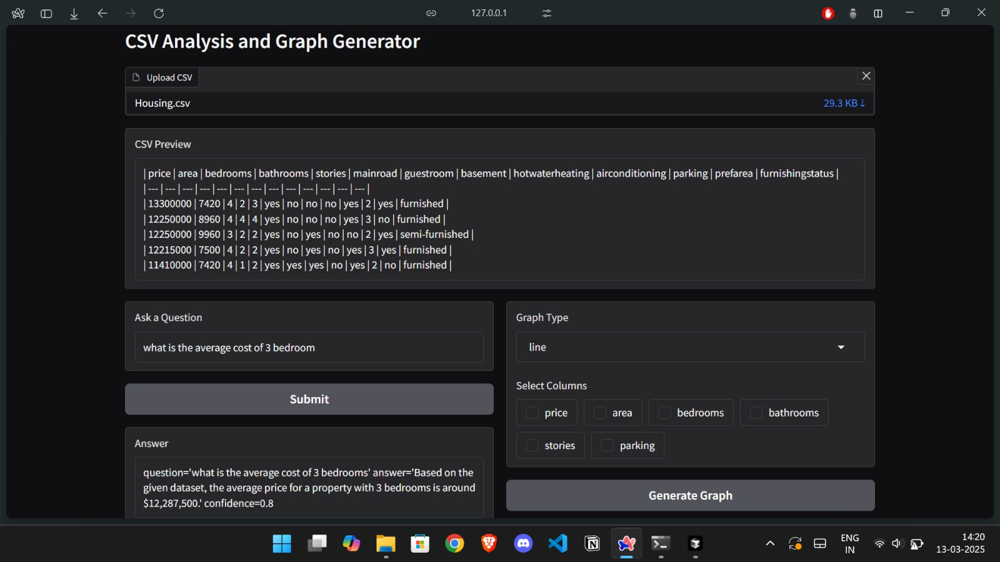
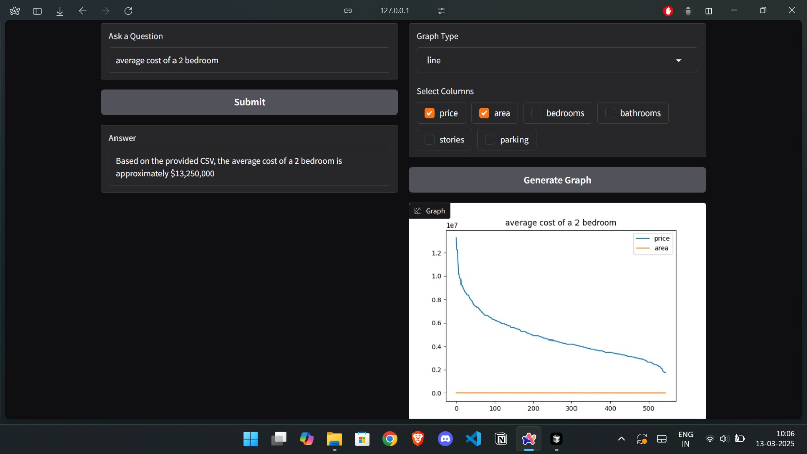

# CSV Analysis and Graph Generator

## Overview
This project is a **Gradio-based CSV Analysis and Graph Generator** that allows users to:
- Upload CSV files and preview the first five rows.
- Ask questions about the CSV data (including numerical queries) using a local **Large Language Model (LLM)**.
- Generate visualizations (line, bar, and scatter plots) directly within the Gradio interface.

The application is built using the following technologies:
- **Gradio**: For the user interface.
- **Pydantic AI**: For structured LLM queries.
- **Ollama**: As the LLM execution backend (using Llama 3.1 8B model).
- **Pandas & Matplotlib**: For CSV handling and graph plotting.

## Screenshots
### CSV Upload and Querying



### Graph Generation

Generates line, bar, and scatter plots based on selected CSV columns.

## Features
### 1. CSV Handling
- Upload and parse CSV files.
- Handles empty CSVs and parsing errors.
- Cleans data by removing columns with >90% missing values and fills missing values with appropriate statistics (mean/mode).

### 2. Question Answering
- Users can ask questions related to the CSV data.
- Leverages **Ollama** and **Pydantic AI** for accurate and structured responses.
- Supports both textual and numerical queries.

### 3. Graph Plotting
- Supports **line**, **bar**, and **scatter** plots.
- Users can select specific columns for visualization.
- Displays graphs directly in the Gradio interface.

### 4. Advanced Pydantic AI Integration
- **System Prompt Augmentation (`@system_prompt`)**: Dynamically enhances the system prompt by providing CSV metadata (e.g., row count and preview) to give the LLM better context for answering questions.
  - This is implemented using the `@system_prompt` decorator to dynamically modify the LLM's context before answering questions.

- **Tool Implementation (`@tool`)**: Implements a `csv_summary` tool, allowing the LLM to access a snapshot of the dataset, improving its ability to analyze and answer questions accurately.
  - The `@tool` decorator is used to register the CSV summary function, enabling the LLM to use it as a utility during the query process.

- **Custom LLM Agent**: Uses the `pydantic_ai.Agent` class to define the CSV analysis flow and structure the query outputs via the `CSVAnalysisResult` model.

## Installation
Ensure you have Python 3.9+ installed.

```bash
# Clone the repository
git clone <repository_url>
cd <project_directory>

# Create virtual environment
python -m venv venv
source venv/bin/activate  # On Windows use `venv\Scripts\activate`

# Install dependencies
pip install gradio pandas matplotlib pydantic pydantic-ai

# Ensure Ollama is running on localhost
ollama serve
```

## Usage
Run the application using the following command:

```bash
python index.py
```

Access the Gradio interface at **http://localhost:7860**.

## Project Structure
```
.
├── index.py              # Main entry point
├── modules
│   ├── csv_handler.py    # CSV upload, validation, and cleaning
│   ├── llm_agent.py      # LLM integration with Pydantic AI and Ollama
│   └── graph_plotter.py  # Graph plotting using Matplotlib
```

## Customization
- **Model Configuration**: Change the `model_name` in `llm_agent.py` to switch between Llama variants.
- **Graph Types**: Extend `plot_data()` to support additional visualizations.

## Troubleshooting
- **CSV not displaying?** Ensure the CSV is valid and under 25MB.
- **LLM not responding?** Verify Ollama is running on `localhost:11434`.

